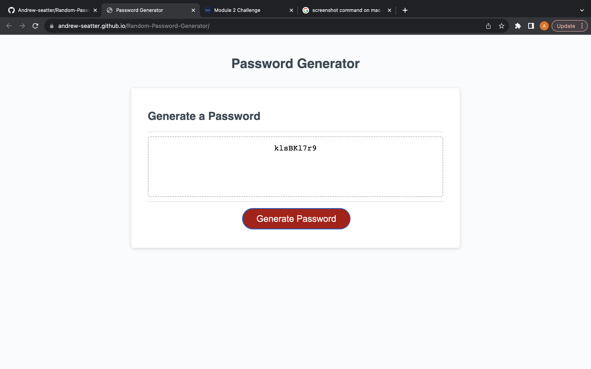

# Random-Password-Generator

## Description

This is a random passowrd generator and my first propject in JavaScript. The password generator will create a random password for you based on certain lengths and parameters of choice. Struggled a little bit with some of the conditional statements trying to find the most effecient way to structure the code and arrived on setting the conditionals with the window prompts, rather than trying to account for a ton of different possible choices. Learned some new ways to loop through and structure arrays on this one

## Usage
The script will execute upon hitting generate password and will feed you 5 different window prompts to choose from. The length of your password, whether or not you'd like lower case characters, upper case characters, numerical characters and symbol characters. Based on your answer your new password will spit out in the box above generate password.

Link to the website: https://andrew-seatter.github.io/Random-Password-Generator/
## Credits
Credit to UCSD bootcamp for the source code on the html and css docs

## License

MIT License

Copyright (c) [2023] [Andrew Seatter]

Permission is hereby granted, free of charge, to any person obtaining a copy
of this software and associated documentation files (the "Software"), to deal
in the Software without restriction, including without limitation the rights
to use, copy, modify, merge, publish, distribute, sublicense, and/or sell
copies of the Software, and to permit persons to whom the Software is
furnished to do so, subject to the following conditions:

The above copyright notice and this permission notice shall be included in all
copies or substantial portions of the Software.

THE SOFTWARE IS PROVIDED "AS IS", WITHOUT WARRANTY OF ANY KIND, EXPRESS OR
IMPLIED, INCLUDING BUT NOT LIMITED TO THE WARRANTIES OF MERCHANTABILITY,
FITNESS FOR A PARTICULAR PURPOSE AND NONINFRINGEMENT. IN NO EVENT SHALL THE
AUTHORS OR COPYRIGHT HOLDERS BE LIABLE FOR ANY CLAIM, DAMAGES OR OTHER
LIABILITY, WHETHER IN AN ACTION OF CONTRACT, TORT OR OTHERWISE, ARISING FROM,
OUT OF OR IN CONNECTION WITH THE SOFTWARE OR THE USE OR OTHER DEALINGS IN THE
SOFTWARE.